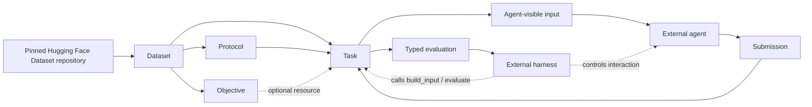

# Architecture and Core Concepts

SciModelingBench separates published scientific observations from the policy
used to expose those observations and from the trusted function used to
evaluate new candidates. This keeps data provenance, agent visibility, and
target evaluation independently inspectable.

The `Dataset`, `Objective`, `Protocol`, and `Task` interfaces are implemented
but experimental. A Task does not necessarily use an Objective; that resource
is added only by `ObjectiveBackedTask` specializations.

## System Flow

The trusted side owns the `Task` and its complete `Dataset`, `Protocol`, and
optional `Objective`. The agent should receive only the object returned by
`Task.build_input()` and the feedback allowed by the external harness.

## Core Concepts

| Concept | Responsibility | Not responsible for |
|---|---|---|
| `Dataset` | Load a pinned observation set with identity, provenance, semantic field roles, validation, split metadata, and optional knowledge | Task-specific data selection, model preprocessing, candidate evaluation, metrics, or agent workflows |
| `Objective` | Map a valid candidate to declared Dataset target fields on the trusted side | Agent-visible data, query budgets, submission handling, or ranking metrics |
| `Protocol` | Construct the data or other information visible to an agent from a complete Dataset | Evaluating candidates, tracking interaction state, or enforcing a query budget |
| `Task` | Bind a Dataset and Protocol to a typed submission contract and evaluation result | Agent execution, isolation, query budgets, or a universal Objective assumption |
| External harness | Run the agent and enforce interaction policy, budgets, isolation, and Task-result disclosure | Not provided by the package |

See the [Dataset](../api/dataset.md), [Objective](../api/objective.md),
[Protocol](../api/protocol.md), and [Task](../api/task.md) API pages for the
implemented contracts.

## Why Task Is a Separate Layer

Dataset, Protocol, and Objective are reusable resources, but none of them alone
defines a complete benchmark problem. Dataset owns scientific observations and
validity rules. Protocol owns what information is exposed. Objective, when
needed, owns a trusted candidate-to-target mapping. The Task is the first layer
that defines what an Agent must submit and how that submission becomes benchmark
metrics.

Keeping Task separate prevents three responsibilities from being mixed:

- changing an Agent-visible data view does not redefine the Dataset;
- calculating a benchmark metric does not become part of Objective lookup;
- query budgets, iterative feedback, and process isolation do not become part
  of a static benchmark definition.

The base `Task` therefore requires only a Dataset and Protocol. An
`ObjectiveBackedTask` adds an Objective for problem types that need trusted
candidate-to-target queries. This leaves room for Tasks whose submissions are
predictions or other artifacts evaluated directly against trusted Dataset data,
without pretending every scientific problem is black-box optimization.

## Dataset Terms

A Hugging Face Dataset **repository** can hold multiple related **configs**.
Each config has one SciModelingBench manifest and one or more published
**splits**. A split is a named group of observations with one schema and shared
split metadata. It is not an agent-visible train/test partition created for a
particular optimization task.

The manifest assigns each declared column one semantic role:

- **input** fields describe a candidate;
- **target** fields are values returned by an Objective;
- **context** fields qualify inputs or targets when scientific meaning depends
  on additional conditions.

Hugging Face `Features` define physical dtypes and shapes. The manifest adds
scientific descriptions, units, common constraints, provenance, and split
identity. Optional knowledge resources provide lazy, revision-pinned text; they
do not replace executable validation.

## Reproducibility Boundary

Dataset construction resolves a requested Hub branch, tag, or commit to a full
commit SHA. The collection index, config manifest, data files, and knowledge
resources are then read from that same resolved revision. `resolved_revision`
records the identity used for every subsequent access.

Published data and manifests are immutable inputs from the framework's point of
view. Protocols return ordinary data objects without mutating the Dataset, and
Objectives validate candidates against the Dataset before evaluation.

## First Supported Task: Black-Box Optimization

The first supported setting is offline black-box optimization:

1. A Protocol derives a limited offline observation set from the complete
   Dataset.
2. An external agent uses that visible data to propose candidates.
3. A trusted Objective returns target values for valid candidates.
4. A black-box optimization Task validates the complete submission and
   aggregates its declared metric.
5. The external harness decides how interactions and Task results are exposed
   to the Agent.

The package does not create a security boundary by itself. Giving agent code a
Dataset handle, the complete data artifact, or Objective internals would bypass
the intended black-box boundary. Process isolation and feedback policy belong
to the harness.

The [TFBind8 suite page](../suites/design-bench/tfbind8.md) describes the first
concrete Dataset, exact Objective, offline-data Protocol, and black-box
optimization Task.

## Deliberately Deferred

The framework does not define a benchmark runner, universal submission schema,
query accounting, iterative feedback, snapshots, or agent memory. Submission
and metric semantics belong to concrete Task subclasses rather than the base
Dataset, Objective, or Protocol APIs.
