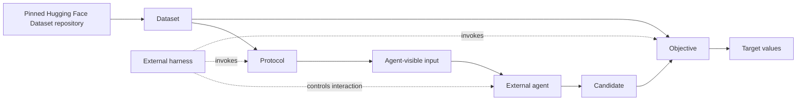

# Architecture and Core Concepts

SciModelingBench separates published scientific observations from the policy
used to expose those observations and from the trusted function used to
evaluate new candidates. This keeps data provenance, agent visibility, and
target evaluation independently inspectable.

The `Dataset`, `Objective`, and `Protocol` interfaces are implemented but
experimental. The `Task` layer described below is a boundary for future work,
not a public API in the first release.

## System Flow

The trusted side owns the complete `Dataset`, the `Protocol`, and the
`Objective`. The agent should receive only the object returned by
`Protocol.build_input()` and the feedback allowed by the external harness.

## Core Concepts

| Concept | Responsibility | Not responsible for |
|---|---|---|
| `Dataset` | Load a pinned observation set with identity, provenance, semantic field roles, validation, split metadata, and optional knowledge | Task-specific data selection, model preprocessing, candidate evaluation, metrics, or agent workflows |
| `Objective` | Map a valid candidate to declared Dataset target fields on the trusted side | Agent-visible data, query budgets, submission handling, or ranking metrics |
| `Protocol` | Construct the data or other information visible to an agent from a complete Dataset | Evaluating candidates, tracking interaction state, or enforcing a query budget |
| Task | Eventually bind a Dataset, Objective, Protocol, and evaluation semantics into one benchmark definition | Not implemented in the first release |
| External harness | Run the agent and enforce interaction policy, budgets, isolation, submissions, and metrics | Not provided by the package in the first release |

See the [Dataset](../api/dataset.md), [Objective](../api/objective.md), and
[Protocol](../api/protocol.md) API pages for the implemented contracts.

## Dataset Terms

A Hugging Face Dataset **repository** can hold multiple related **configs**.
Each config has one SciModelingBench manifest and one or more published
**splits**. A split is a named group of observations with one schema and shared
split metadata. It is not an agent-visible train/test partition created for a
particular optimization task.

The manifest assigns each declared column one semantic role:

- **input** fields describe a candidate;
- **target** fields are values returned by an Objective;
- **context** fields qualify inputs or targets when scientific meaning depends
  on additional conditions.

Hugging Face `Features` define physical dtypes and shapes. The manifest adds
scientific descriptions, units, common constraints, provenance, and split
identity. Optional knowledge resources provide lazy, revision-pinned text; they
do not replace executable validation.

## Reproducibility Boundary

Dataset construction resolves a requested Hub branch, tag, or commit to a full
commit SHA. The collection index, config manifest, data files, and knowledge
resources are then read from that same resolved revision. `resolved_revision`
records the identity used for every subsequent access.

Published data and manifests are immutable inputs from the framework's point of
view. Protocols return ordinary data objects without mutating the Dataset, and
Objectives validate candidates against the Dataset before evaluation.

## Black-Box Optimization in the First Release

The first supported setting is offline black-box optimization:

1. A Protocol derives a limited offline observation set from the complete
   Dataset.
2. An external agent uses that visible data to propose candidates.
3. A trusted Objective returns target values for valid candidates.
4. The external harness decides how many queries are allowed and how results
   are scored.

The package does not create a security boundary by itself. Giving agent code a
Dataset handle, the complete data artifact, or Objective internals would bypass
the intended black-box boundary. Process isolation and feedback policy belong
to the harness.

The [TFBind8 suite page](../suites/design-bench/tfbind8.md) describes the first
concrete Dataset, exact Objective, and offline-data Protocol.

## Deliberately Deferred

The first release does not define a Task interface, benchmark runner, standard
submission schema, invalid-submission policy, query accounting, iterative
feedback, snapshots, agent memory, or metrics. These semantics should not be
inferred from the current Dataset, Objective, or Protocol APIs.
